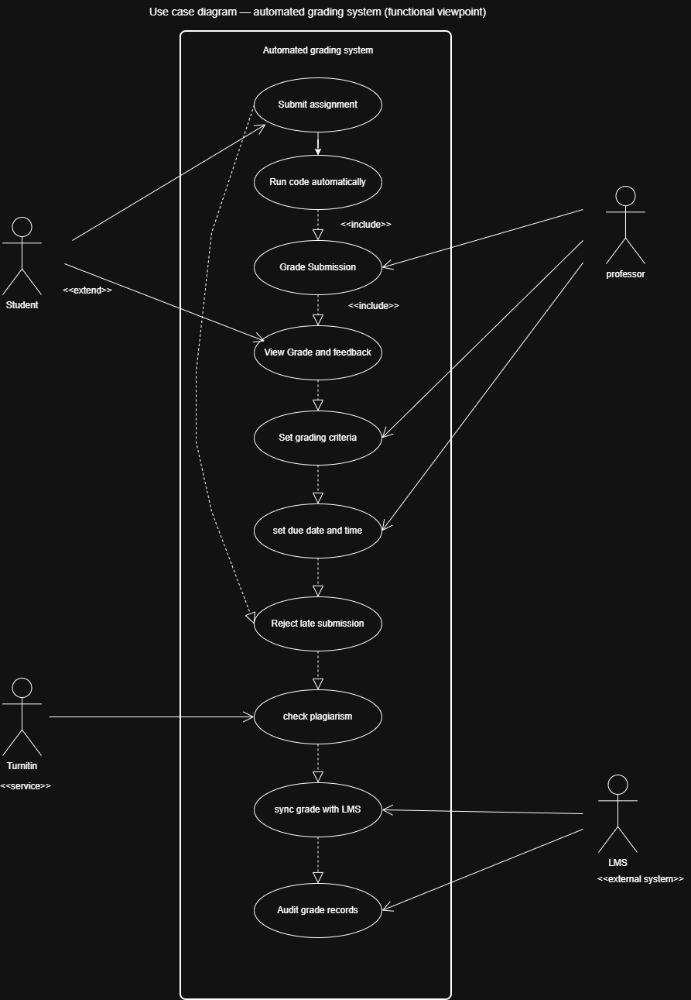
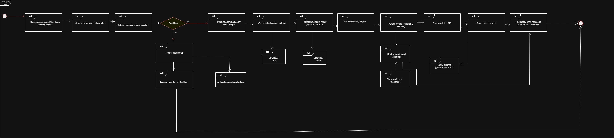

# SDA202: Software Design and System Architecture
## Practical 2: UML – Use Case Diagram

---

### Scenario Summary

The university's SWE course has 300+ students per year. Currently, students submit assignments to GitHub and professors manually clone, run, and inspect code in VSCode and terminal. No plagiarism checker or automated marking software exists. The university requires an automated grading system to replace this manual process.

### Identified Actors

| Actor | Type | Role |
|---|---|---|
| **Student** | Primary | Submits source code; views grades and feedback |
| **Professor** | Primary | Sets grading criteria and deadlines; reviews grades and audit trail |
| **TurnItIn** | External system | Web-based plagiarism detection service |
| **LMS** | External system | University's mainframe-based learning management system; stores and displays grades |
| **Regulatory Body** | Secondary | State body that conducts annual audits of grade records |

### Identified Requirements

| # | Requirement | Source |
|---|---|---|
| R1 | Students must be able to upload source code which will be run and graded | Stated |
| R2 | Grades and runs must be persistent and auditable | Stated |
| R3 | Plagiarism detection must compare submissions internally and via TurnItIn | Stated |
| R4 | System must integrate with the university LMS | Stated |
| R5 | Professor sets a due date and time; late submissions must be rejected | Stated |
| R6 | Students can submit multiple attempts to improve their grade | Stated |
| R7 | Professor determines grading criteria, including metrics and/or tests | Stated |

### Constraints Identified

- The LMS is mainframe-based and difficult to modify — it must be treated as an external integration point, not a system component
- The university has a very limited IT budget — third-party services (TurnItIn) reduce in-house development scope
- Grades are audited annually by a state regulatory body — audit trail persistence is non-negotiable

---

### Task 1 — Interaction Overview Diagram: Actor-to-Actor (Context Viewpoint)

This diagram captures the **current manual workflow** from a context viewpoint, with no system involvement. It maps how actors interact with each other to achieve the business outcome of a graded and recorded assignment.

**Interaction Flow:**

1. Student submits assignment code to GitHub repository
2. Professor clones the repository to local machine
3. Professor runs the code in terminal and inspects it in VSCode
4. Professor initiates a plagiarism check by submitting work to TurnItIn
5. TurnItIn returns a similarity report to the professor
6. Professor assigns a grade and records it manually in the LMS
7. Student accesses their grade via the LMS
8. Regulatory Body audits grade records in the LMS annually

*Figure 1: IoD showing actor-to-actor interactions in the current manual grading process (context viewpoint).*

---

### Task 2 — Use Case Diagram: Functional Viewpoint

This diagram introduces the **system boundary** and maps all functional capabilities the automated grading system must provide.

**Use Cases:**

| ID | Use Case | Actor(s) |
|---|---|---|
| UC1 | Submit assignment | Student |
| UC2 | Run code automatically | System |
| UC3 | Grade submission | System |
| UC4 | View grade and feedback | Student, Professor |
| UC5 | Set grading criteria | Professor |
| UC6 | Set due date and time | Professor |
| UC7 | Reject late submission | System |
| UC8 | Check plagiarism | System, TurnItIn |
| UC9 | Sync grade with LMS | System, LMS |
| UC10 | Audit grade records | LMS, Regulatory Body |

**Relationships:**

| Relationship | Type | Rationale |
|---|---|---|
| UC1 → UC2 | `«include»` | Code execution is a mandatory step of every valid submission |
| UC2 → UC3 | `«include»` | Grading always follows successful code execution |
| UC3 → UC8 | `«include»` | Every graded submission must pass plagiarism detection |
| UC3 → UC9 | `«include»` | Graded results must always be pushed to the LMS |
| UC1 → UC7 | `«extend»` | Rejection is conditional — only triggered when the deadline has passed |
| 

| 
*Figure 2: Use Case Diagram showing all system use cases, actors, and relationships (functional viewpoint).*

---

### Task 3 — Interaction Overview Diagram: System-Supported (Use Case Viewpoint)

This diagram refines Task 1 by introducing the automated grading system as a mediating actor. A swimlane layout is used to show which entity is responsible for each step.

**Swimlanes:**

| Swimlane | Responsibility |
|---|---|
| Student | Submits code; receives rejection or grade notification; views results |
| Automated Grading System | Validates deadline; executes code; grades; checks plagiarism; persists records; syncs to LMS; notifies actors |
| Professor | Configures assignment (criteria + deadline); reviews grades and audit trail |
| TurnItIn | Receives submission; returns similarity report |
| LMS / Regulatory Body | Stores synced grades; provides audit records annually |

**System-Supported Flow:**

1. Professor configures the assignment — sets due date and grading criteria; system stores config
2. Student submits code via the system interface
3. System checks the deadline — if overdue, notifies student of rejection (`«extend»`)
4. System executes submitted code and collects output (`«include»` UC2)
5. System grades the submission against professor's criteria (`«include»` UC3)
6. System initiates plagiarism check internally and via TurnItIn (`«include»` UC8)
7. TurnItIn returns similarity report to the system
8. System persists all results in an auditable trail (R2)
9. System syncs grade to LMS (`«include»` UC9)
10. System notifies student; student views grade and feedback
11. Professor reviews grades and audit trail
12. Regulatory Body accesses audit records from LMS annually

*Figure 3: System-supported IoD with swimlane layout (use case viewpoint).*

---

## 1.3 Quality Attributes Consideration (5 marks)

The following quality attributes were identified from the requirements and constraints, and directly influenced the architectural design decisions reflected in the diagrams.

### Auditability

**Requirement source:** R2 — grades and runs must be persistent and auditable; grades are audited annually by a state regulatory body.

**Design decision:** A dedicated *Store results / audit trail* step was included in Task 3 as a separate system action after grading and plagiarism checking. The *Audit grade records* use case (UC10) in Task 2 was also explicitly connected to both the LMS and the Regulatory Body. This ensures the audit chain — from submission, through grading, to the stored record — is traceable and accessible to external auditors without modifying the LMS directly.

### Reliability and Deadline Enforcement

**Requirement source:** R5 — professor sets a due date and time; after which submissions must be rejected.

**Design decision:** The late rejection is modelled as an `«extend»` relationship from UC1 (Submit assignment), meaning it is a conditional behaviour that does not interrupt the normal flow. In Task 3, the deadline check is positioned immediately after the student submits, before any code execution occurs. This prevents wasted compute on ineligible submissions and ensures consistent enforcement regardless of professor availability.

### Scalability

**Requirement source:** 300+ students per year; R6 — students can submit multiple attempts.

**Design decision:** Separating *Run code automatically* (UC2) and *Grade submission* (UC3) as distinct use cases allows these to be treated as independent, scalable processes. Multiple submission attempts are accommodated by the same submission-execution-grading pipeline without requiring architectural changes. The automated pipeline replaces the manual per-student effort of the professor, making the system viable at scale.

### Integration and Interoperability

**Requirement source:** R4 — integration required with the university LMS; LMS is mainframe-based and difficult to modify.

**Design decision:** The LMS is positioned as an *external actor* in all three diagrams rather than a system component. The automated grading system pushes grades to the LMS via a sync step (UC9), leaving the LMS unchanged. This minimises integration risk and respects the constraint that the LMS cannot easily be modified. TurnItIn is similarly kept external (UC8) as a service the system calls rather than a component it owns.

### Budget Awareness

**Requirement source:** University has very limited IT budget.

**Design decision:** Using TurnItIn as an external third-party service rather than building plagiarism detection fully in-house reduces the development scope and cost of the system. This is reflected in the diagrams by TurnItIn being an external actor connected via a service boundary, not an internal use case. Internal comparison across student submissions is handled by the system itself, while the more complex web-based similarity check is delegated to TurnItIn.

---
---

# Practical Report (5 marks)

---

## 2.1 Reflection (3 marks)

### What I Did

In this practical, I developed three UML diagrams for an automated university assignment grading system: an actor-to-actor Interaction Overview Diagram showing the current manual process, a Use Case Diagram capturing the system's functional requirements, and a system-supported Interaction Overview Diagram with swimlanes showing how actors interact through the system.

### What I Learned

The most valuable insight from this practical was understanding how the three diagram types serve different purposes and audiences, yet build directly on one another. The context viewpoint (Task 1) helped me identify all actors and their goals before any system design began. This made the functional viewpoint (Task 2) significantly easier — because I already understood what each actor needed, mapping those needs to use cases felt natural rather than arbitrary.

I also developed a much clearer understanding of the `«include»` versus `«extend»` distinction. I initially placed *Reject late submission* as an `«include»` from *Submit assignment*, reasoning that deadline checking always happens. After reviewing the definition more carefully, I realised `«include»` implies the included behaviour always completes as part of the base use case — but rejection only occurs under a specific condition. The correct modelling is `«extend»`, which represents conditional, optional behaviour that extends the base without being required for it to succeed.

### What I Found Difficult

The hardest part was determining the correct system boundary. The LMS is a real system that stores grades, and it was tempting to include grade storage as a use case inside the system boundary. However, because the LMS is mainframe-based and cannot be easily modified, including it as an internal component would misrepresent the actual architecture. Treating it as an external actor and modelling the integration as a sync step (UC9) was the correct decision, but it required careful reasoning about what the system owns versus what it integrates with.

The swimlane diagram (Task 3) was also more complex than expected. Ensuring each step was placed in the correct lane, and that arrows between lanes accurately reflected direction of communication, required several iterations before the diagram was coherent.

### How I Would Improve

If I were to repeat this practical, I would start by explicitly listing all constraints before drawing any diagram. Knowing upfront that the LMS could not be modified and that TurnItIn was a third-party service would have immediately clarified the system boundary and saved revision time. I would also sketch the actor-to-actor IoD on paper first before moving to a diagramming tool, as early rough sketching encourages freer thinking before committing to a layout.

---

## 2.2 Clarity & Coherence (2 marks)

This report is structured to directly follow the marking criteria: practical work (requirements analysis, architectural design, quality attributes) is presented first as the primary deliverable, followed by the reflective report section. Each diagram is introduced with its purpose and key decisions before the diagram is shown, so the reader understands what to look for. Tables are used throughout to present structured information — actors, requirements, use cases, and relationships — in a scannable format. The three tasks are presented in sequence to make explicit how each diagram builds on the previous one, progressing from the context viewpoint through the functional viewpoint to the system-supported viewpoint.

---

## References

- GeeksForGeeks. (2024). *Interaction Overview Diagrams – UML*. Retrieved from https://www.geeksforgeeks.org/interaction-overview-diagrams-unified-modelinglanguage-uml/
- Visual Paradigm. (2024). *What is Interaction Overview Diagram?* Retrieved from https://www.visual-paradigm.com/guide/uml-unified-modeling-language/what-is-interaction-overview-diagram/
- GeeksForGeeks. (2024). *Use Case Diagram*. Retrieved from https://www.geeksforgeeks.org/use-case-diagram/
- Fowler, M. (2003). *UML Distilled: A Brief Guide to the Standard Object Modeling Language* (3rd ed.). Addison-Wesley.